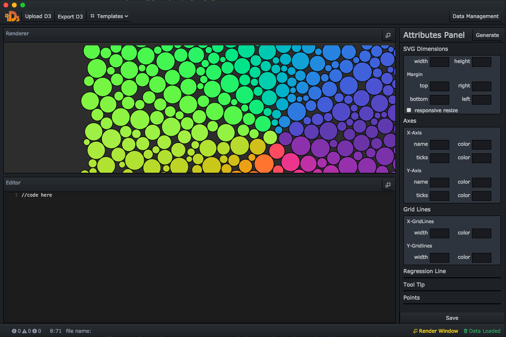
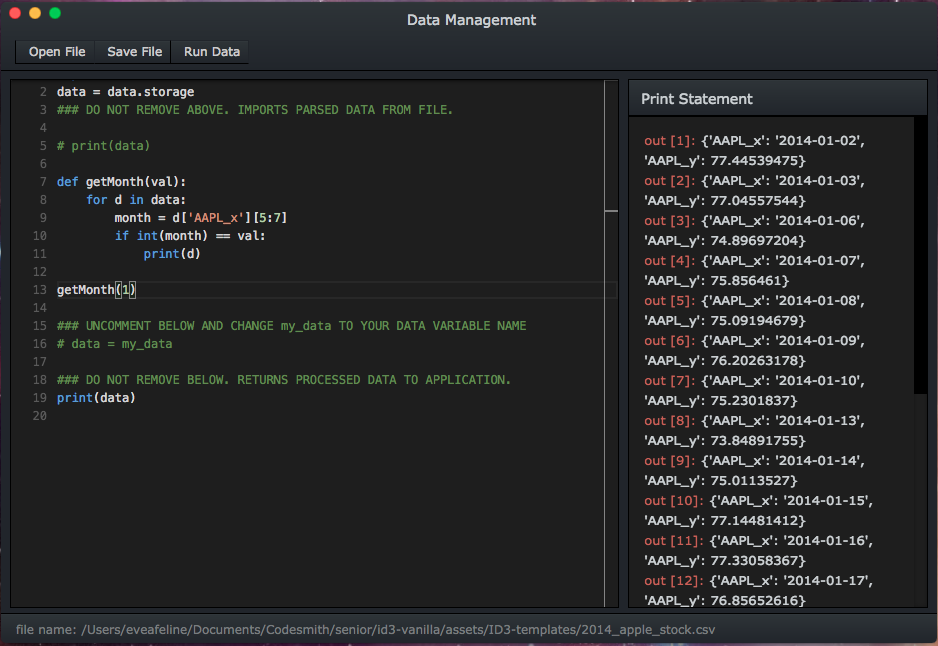

<p align="center"><a href='http://d3-id3.com/'></a></p>

### iD3 - an IDE dedicated for development in D3.js
iD3 is an open-source, cross-platform desktop application geared to simplify data visualization with D3 for non-JavaScript and JavaScript data scientists and analysts. With our integrated Python based data management system and custom generated attribute controls, iD3 supports the full process from importing your data to exporting your final presentation.


#### iD3 is in active development. Please follow this repo for contribution guidelines and upcoming updates.

##
<p align="center">
  
</p>

## To Use
Fork or download
```
# Clone this repository
git clone https://github.com/C-JSN/D3-ID3.git
# Go into the repository
cd D3-ID3
# Install dependencies
npm install  
# Run webpack
npm run webpack
# Run the app  
npm start  
```
Please make sure you have Python 3.6 installed.
Click [here](https://www.python.org/downloads/) to install [Python 3.6](https://www.python.org/downloads/)

### Keyboard shortcuts:
```
ctrl + s (main app editor) = run code and render
ctrl + s (data management editor) = run code
```

### Take control of your visualization
Upload your own D3 code and see it visualized immediately on the Renderer. Modify your data visualization straight in the editor, or through the custom generated attribute controls to your right and see your changes reflected in the Renderer as you go.

#### New to D3? Use a Template
Select a template from our library and start creating right away.

#### Export files
Export your finalized code to be used on your other projects!

Note: Refresh the Attribute Panel by clicking `Generate Attr` when you upload a new file or run a new template

##
<p align="center">
  
</p>

### Data Management
D3 is Data Driven Document. Data is a big part of what makes D3 so powerful. 

## Resources
Find us on www.d3-id3.com  
Special thanks to Mike Bostock for creating [D3.js](https://d3js.org/)  

## Contributors
[Christian Pascual](https://github.com/crp2002) | [Jeffrey Ma](https://github.com/jjeffreyma) | [Steve Meads](https://github.com/smeads) | [Naomi Lai](https://github.com/eveafeline)

## License
[MIT](https://spdx.org/licenses/MIT.html#licenseText)
